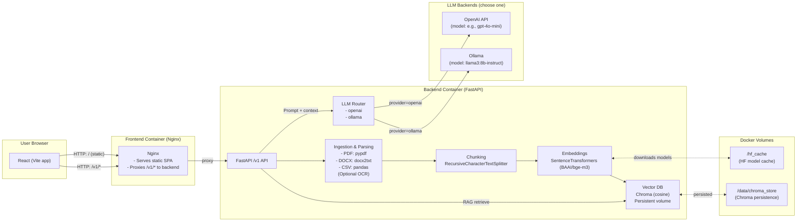
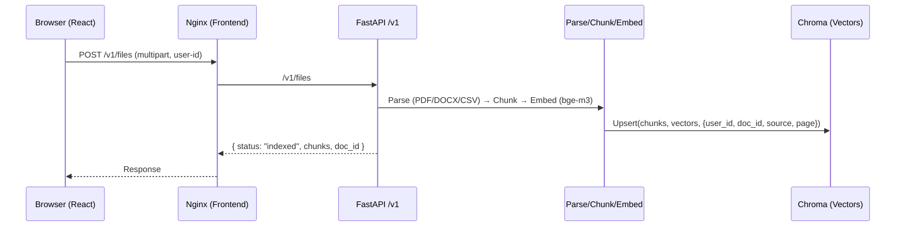
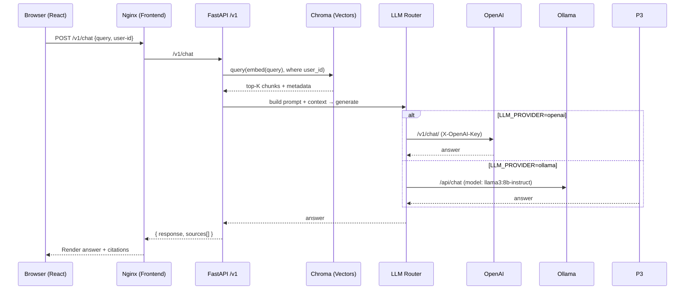

# Documents Chat — High-Level Architecture

This document outlines the production and development topology, the RAG pipeline, and the LLM routing options.

> **Note:** GitHub renders Mermaid diagrams automatically. If viewing elsewhere, you may need a Mermaid-compatible viewer.

## System Overview

## Request / Response Flows

### Upload & Index (RAG)

### Chat over Documents (RAG + LLM)

