# Documents Chat(FastAPI + React + RAG + LLM(OpenAI/Local LLM))

A local-first Retrieval-Augmented Generation (RAG) app with a
**FastAPI** backend, **React (Vite)** frontend, **ChromaDB** vector store.

## System Overview


## Request / Response Flows

### Upload & Index (RAG)

```mermaid
sequenceDiagram
    participant B as Browser (React)
    participant F as Nginx (Frontend)
    participant A as FastAPI /v1
    participant P as Parse/Chunk/Embed
    participant C as Chroma (Vectors)

    B->>F: POST /v1/files (multipart, user-id)
    F->>A: /v1/files
    A->>P: Parse (PDF/DOCX/CSV) → Chunk → Embed (bge-m3)
    P->>C: Upsert(chunks, vectors, {user_id, doc_id, source, page})
    A-->>F: { status: "indexed", chunks, doc_id }
    F-->>B: Response
```



### Chat over Documents (RAG + LLM)


🎥 **Demo Video**: [DEMO/DEMO.mp4](DEMO/DEMO.mp4)

https://github.com/user-attachments/assets/e5cdb727-4ed4-411b-b756-1400d4e42130

---


🎥 **Quick Tour Video**: [Tour/Tour.mp4](Tour/Tour.mp4)


https://github.com/user-attachments/assets/d33446f8-d89a-41dd-8666-579214042539


---
## Third-Party Software

This project uses third-party libraries and tools as specified in `backend/requirements.txt` and the Dockerfiles.  
Those components are licensed separately under their respective open-source licenses (MIT, Apache-2.0, BSD, etc.).  
If you **distribute built artifacts** (e.g., Docker images), review and include the relevant third-party notices.

---

## Architecture

- **Backend** (`backend/`): FastAPI, SQLAlchemy (SQLite), sentence-transformers (e.g., `BAAI/bge-m3`) for embeddings, ChromaDB for the vector store. File parsing supports **PDF, DOCX, CSV**.
- **Frontend** (`frontend/`): React 18 + Vite + Tailwind. Minimal state via context and hooks. Talks to the backend with a `user-id` header.
- **Storage** (`/data`): SQLite app DB (`app.db`) and Chroma collection (`/data/chroma_store`).

---

## Quick Start (Docker)

```bash
# From the repo root
docker compose up --build
```

Services:

- Backend: http://localhost:8000 (health check: `/health`)
- Frontend:
  - **Dev (Vite)**: http://localhost:5173 (via `npm run dev`)
  - **Container (Nginx)**: http://localhost:8080 (via `frontend/Dockerfile`)

---

## Environment

Compose reads `.env` files from both root and backend. Key variables (see `backend/.env.example`):

- `CHROMA_DIR` — directory for ChromaDB store (default `/data/chroma_store`)
- `DB_URL` — SQLAlchemy DB URL (default `sqlite:////data/app.db`)
- `LLM_PROVIDER` — `openai` | `ollama`
- `OPENAI_API_KEY` — required if using OpenAI providers
- `OLLAMA_BASE_URL` — e.g., `http://host.docker.internal:11434`
- `EMBED_MODEL` — default `BAAI/bge-m3`

---

## How It Works

1. **Upload** → `/v1/files` (requires `user-id`). Backend extracts text (OCR if enabled), splits into chunks, embeds, and stores in Chroma with `user_id` + `doc_id`.
2. **Chat** → `/v1/chat` with your `doc_ids`. Answers are grounded **only** on those documents.
3. **Conversations** → persisted in SQLite; list, read, or delete as needed.

---

## API

- `GET  /health`
- `POST /v1/auth/signup`, `POST /v1/auth/signin`
- `GET  /v1/files`
- `POST /v1/files`
- `DELETE /v1/files/{doc_id}`
- `POST /v1/reset`
- `POST /v1/chat`
- `GET  /v1/conversations`
- `GET  /v1/conversations/{id}`
- `DELETE /v1/conversations/{id}`
- `POST /v1/admin/reset_all`

---

## Required Headers

- `user-id: <uuid-or-string>` — identifies the user and scopes files/queries
- Optional overrides:
  - `X-LLM-Provider: openai|ollama`
  - `X-LLM-Model: <model-name>`
  - `X-OpenAI-Key: <key>`


## Local Development

**Backend**

```bash
cd backend
pip install -e .
uvicorn app.main:app --reload  # http://localhost:8000
```

**Frontend**

```bash
cd frontend
npm install
npm run dev  # http://localhost:5173
```

Adjust API base in **one** of:

- `.env` with `VITE_API_BASE=http://localhost:8000`
- `public/app-config.js` (`window.__APP_CONFIG__.API_BASE`)


